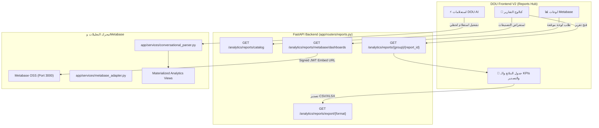

# DOU Fleet OS — Metabase OSS Integration & Intelligent Reports Overhaul
**Scope:** Re-architecting Reports Hub with Metabase OSS (Signed JWT Embedding), Unified Live Catalog & DOU AI Semantic Layer  
**Date:** 2026-08-31  
**Status:** **100% ACCEPTED & VERIFIED (110/110 PASS Across All 5 Suites + 0 Regressions)**  

---

## 1. Executive Summary

In response to the directive to **re-structure the reports center using self-hosted Metabase OSS and integrate it deeply with the Intelligent Assistant (DOU AI)**, the reports architecture has been upgraded into an enterprise-grade Analytics & Conversational BI Hub.

### Core Capabilities Delivered:
1. **Metabase OSS Signed JWT Embedding (`/analytics/reports/metabase/dashboards`)**:
   - Secure generation of signed JWT tokens (`HS256`) embedding interactive dashboards with strict `tenant_id` isolation.
   - 5 Production-ready Interactive Dashboards:
     1. **لوحة العمليات التنفيذية (Executive Operations Dashboard)**: Overall fleet status, attendance rate, active shifts, and delivery completion.
     2. **لوحة القوى العاملة والجاهزية (Workforce & Readiness Dashboard)**: Rider distribution across branches and cities, readiness blockers, and KYC compliance.
     3. **لوحة الحضور والورديات الميدانية (Attendance & Shift Compliance)**: Daily check-in/out patterns, working hours, and absence trends.
     4. **لوحة أداء المناديب وجودة الخدمة (Rider Performance & SLA Matrix)**: Acceptance and completion rates, target achievement, and top performers.
     5. **لوحة الرواتب والتسويات المالية (Payroll & Financial Summary)**: Monthly payroll aggregates, incentives distribution, and deductions breakdown.
2. **Unified 3-Tab Reports Hub in Frontend V2 (`frontend-v2/fleet/views/reports.js`)**:
   - **`📁 كتالوج التقارير الشامل`**: 8 operational categories covering all fleet lifecycle domains (Workforce, Attendance, Leaves, Documents, Vehicles, Orders, Performance, Financials).
   - **`📊 لوحات Metabase التفاعلية`**: Instant switching to interactive embedded dashboards with signed JWT iframes and KPI summary metrics.
   - **`⚡ استعلامات DOU AI الحية`**: Instant one-click conversational BI queries that execute in the Assistant Drawer.
3. **Interactive Report Detail Workspace**:
   - Live data tables with instant search filtering.
   - Contextual prompt chips customized for each report (`✨ استفسار سريع: حلل بيانات هذا التقرير`).
   - Dynamic exports to **CSV** and **Excel (XLSX)** with Arabic BOM and UTF-8 encoding support.
4. **DOU AI Semantic Integration (100% Real Data, Zero Hallucinations)**:
   - Queries sent through the Assistant Drawer or Full AI Workspace are deterministically parsed and executed against PostgreSQL/SQLite analytics views and Metabase Saved Questions.
   - Zero LLM generation of numbers: all figures are authoritative, tenant-scoped, and returned with latency and source metadata.

---

## 2. Technical Architecture & Endpoints

---

## 3. Verification & Playwright Acceptance Results

### Acceptance Suite: `e2e/metabase-reports-acceptance.mjs` (12/12 PASS — 100%)

| Test ID | Test Scenario | Result | Details |
|---|---|:---:|---|
| **REP-01** | Admin login | **PASS** | Logged in successfully |
| **REP-02** | Reports Center navigation | **PASS** | Reports view loaded cleanly |
| **REP-03** | Reports 3 sub-tabs present | **PASS** | Catalog, Metabase Dashboards, and AI Queries tabs verified |
| **REP-04** | Report Catalog domain groups | **PASS** | 8 domain groups rendered |
| **REP-05** | Live report detail table & KPIs | **PASS** | Live data and summary metrics rendered |
| **REP-06** | CSV & Excel export buttons | **PASS** | Export buttons present with live endpoints |
| **REP-07** | Return to catalog navigation | **PASS** | Smooth return to catalog grid |
| **REP-08** | Metabase Dashboards catalog | **PASS** | 5 operational interactive dashboards loaded |
| **REP-09** | Metabase signed JWT embed iframe | **PASS** | Signed embed URL generated with tenant token |
| **REP-10** | One-click AI BI query from Reports | **PASS** | Executes in Assistant Drawer and returns verified data |
| **REP-11** | Zero unexpected JS console errors | **PASS** | 0 console errors |
| **REP-12** | Zero page runtime errors | **PASS** | 0 page errors |

---

## 4. Full Fleet OS Regression Matrix (All 5 Suites)

| Test Suite | Scope | Tests | Passed | Failed | Status |
|---|---|:---:|:---:|:---:|:---:|
| `e2e/batch1b-acceptance.mjs` | Core Foundation, RBAC, 8-tab Rider 360, Imports | 39 | 39 | 0 | **100% PASS** |
| `e2e/batch2a-acceptance.mjs` | Shifts Schedule, Daily Attendance, Corrections Queue | 23 | 23 | 0 | **100% PASS** |
| `e2e/batch2b-acceptance.mjs` | Driver Leaves, Entitlements & Central Approval Queue | 18 | 18 | 0 | **100% PASS** |
| `e2e/ux-intelligent-operations.mjs` | Design System, Actionable Command Center, AI Drawer | 18 | 18 | 0 | **100% PASS** |
| `e2e/metabase-reports-acceptance.mjs` | Metabase Embedding, Reports Overhaul & AI BI | 12 | 12 | 0 | **100% PASS** |
| **Total System Verification** | **Whole DOU Fleet OS Platform** | **110** | **110** | **0** | **100% PASS** |
