# DOU PRODUCT ARCHAEOLOGY & FUNCTIONAL RECOVERY AUDIT
## V1 (Legacy Frontend) → Frontend V2 Deep Product & Code Audit

**Repository:** `/Users/sameh/DOU-review/dou-server`  
**Execution Mode:** Local, Read-Only Audit & Gap Analysis  
**Audit Date:** 2026-08-31  
**Author:** Antigravity Product & Systems Architecture Agent  

---

## 1. EXECUTIVE SUMMARY

### 1.1 Background & Context
The DOU platform evolved from an initial multi-purpose delivery dispatch platform into a dedicated **Fleet and Rider Workforce Management Operating System (Fleet OS)** for logistics operators, delivery platforms (Jahez, HungerStation, Ninja, etc.), and mixed delivery enterprises. 

The legacy frontend (**V1**, primarily monolithic single-file applications in `static/fleet.html`, `static/admin.html`, `static/workforce.html`, and `static/courier.html`) reached a feature-rich and operationally deep state. However, its monolithic nature, coupled with legacy delivery marketplace remnants (Phase 2 dispatch, merchants, consumer order tracking), inconsistent state management, and direct DOM mutations, led to frontend instability.

**Frontend V2** was conceived and built from scratch as a modern, modular native web application (ES Modules, Vanilla JS, clean component system, reactive store, unified API client). V2 established a strictly locked **8-item Fleet sidebar Information Architecture (IA)** and a unified **Rider 360 Workspace (8 tabs)**, cleanly excluding Phase 2 consumer marketplace scope while ensuring strict backend-enforced RBAC and deterministic DOU AI conversational BI.

### 1.2 What V1 Did Well
1. **Operational Completeness:** V1 provided end-to-end coverage of the physical operations life cycle: managing commercial client contracts, multi-city operating branches, supervisor-to-rider hierarchies, vehicle assignments, bonus plan formulas, manual financial adjustments (advances, deductions, overtime, penalties), and monthly payroll finalization.
2. **Dedicated Exception Hubs:** V1 integrated rich violation and risk monitors (`view-compliance`, `attendanceEventsCard`, `vExpired`/`vSoon`/`vSuspended`/`vRating` violation counters) allowing managers to immediately click into modal drill-downs of non-compliant riders.
3. **Supervisor Enablement:** V1 understood the supervisor's daily routine—enabling team broadcasts, candidate assignment requests to admins, daily logs reviews, and qualitative rider ratings.
4. **Driver Self-Service PWA:** `static/courier.html` provided a mobile-first 5-tab PWA covering GPS shift check-in/out, daily performance logging, verified target progress, salary slip previews, document uploads, and structured HR requests (advances, shift changes, maintenance, incident reports).

### 1.3 What Frontend V2 Improved
1. **Modular Architecture & Maintainability:** Replaced monolithic 2,900+ line HTML files with clean ES Modules (`shared/api/client.js`, `shared/state/store.js`, `shared/components/ui.js`, `fleet/views/*`, `admin/views/*`).
2. **Cognitive Simplicity & Role Focus:** Replaced sprawling, duplicate menus with a locked, canonical 8-item Fleet navigation and an intuitive 8-tab Rider 360 workspace.
3. **Strict Phase Boundary Enforcement:** Completely stripped out Phase 2 consumer/merchant marketplace widgets (orders, dispatch pipelines, SLA countdowns, channel integrations) that do not belong in Fleet OS Phase 1.
4. **Deterministic AI Conversational BI:** Native integration with server-side governed `dou_ai` without runtime LLM hallucinations or cross-tenant data leaks.
5. **Modern Import & Data Flow:** Centralized bulk import workflows directly inside the Riders screen with clear template downloads, structured validation previews, error summaries, and history tracking.

### 1.4 What Was Lost or Left Incomplete in V2
1. **Fleet-Wide Daily Attendance Management:** `shifts.js` in V2 only manages shift schedules and assignments; it does not display the daily attendance check-in/out records, GPS timestamps, or late/early flags across the fleet.
2. **Vehicle Fleet Registry & Lifecycle Management:** While vehicle assignment exists inside Rider 360 Profile, V2 has no fleet-wide vehicle inventory screen (plate registry, vehicle documents, compliance status, maintenance tracking) despite rich backend API support in `app/routers/vehicles.py`.
3. **Commercial Contracts & Operating Cities Configuration:** V1 allowed creating operating cities and client contracts with rate cards and branch structures. V2 only reads existing contracts in dropdowns and lacks configuration surfaces.
4. **Financial Adjustments & Bonus Plan Rule Builder:** V2 displays payroll summaries and rider breakdowns, but lacks the ability to add financial adjustments (advances, penalties, overtime) or define bonus plan tiers (`/hr/bonus`, `/salary/structures`).
5. **Supervisor Actions & Team Communication:** Supervisor-specific actions (requesting rider assignment, team broadcasts, performance ratings) present in V1 have no UI controls in V2.
6. **Super Admin Management Controls:** Super Admin V2 has placeholder screens (`plans.js`, `integrations.js`, `settings.js`) lacking interactive forms for tenant creation, manual payment receipt recording, and plan limits.

### 1.5 Does V2 Match V1's Strongest Operational State?
**Verdict:** **Partially (Architectural Baseline Ready, Operational Breadth Incomplete).**  
Frontend V2 is vastly superior in software architecture, reliability, testability, security isolation, and navigation clarity. All core daily CRUD workflows verified in Batch 1 (Riders, Shifts, Rider 360 tabs, Reports, Capacity, Needs Attention, Bulk Import) work reliably without console errors. However, V2 does **not** yet match V1's operational breadth for organizational setup, fleet asset inventory, financial adjustments, and supervisor field workflows.

### 1.6 Five Most Important Conclusions
1. **Do Not Revert to V1:** The V1 architecture is monolithic and unmaintainable. All recovery must be implemented as clean, modular views/modals in Frontend V2.
2. **Preserve the 8-Item Fleet Sidebar:** Do not add top-level sidebar items. Missing operational capabilities (Vehicles, Contracts/Cities, Bonus Plans, Attendance Logs) should live naturally inside sub-tabs of existing screens (`Shifts & Attendance`, `Payroll & Incentives`, `Riders`) or contextual action drawers.
3. **Expose Existing Backend Power:** Over 70% of missing V1 capabilities already have complete, production-grade backend routers and services (`vehicles.py`, `salary.py`, `timekeeping.py`, `workforce.py`, `leave.py`, `notifications.py`, `supervisor.py`, `enterprise.py`). They only need frontend UI wiring.
4. **Driver App Is Solid & Preserved:** The legacy Driver PWA (`static/courier.html`) is functionally comprehensive and should remain the active mobile driver interface.
5. **Targeted Recovery in 4 Iterative Batches:** Functional recovery should be executed in prioritized, independently testable batches to reach full Pilot and Enterprise readiness without regression.

---

## 2. ARCHITECTURE & ROUTE MAP

### 2.1 File System & Artifact Locations

| Component | V1 Legacy Location | Frontend V2 Location | Shared / Backend Layer |
|---|---|---|---|
| **Fleet Portal** | `static/fleet.html` (263 KB) | `frontend-v2/fleet/` (`main.js`, `shell.js`, `views/*.js`) | `app/routers/fleet.py`, `app/routers/operations.py`, `app/routers/hr.py` |
| **Super Admin Portal** | `static/admin.html` (103 KB) | `frontend-v2/admin/` (`main.js`, `shell.js`, `views/*.js`) | `app/routers/admin.py`, `app/routers/billing.py` |
| **Driver PWA Portal** | `static/courier.html` (58 KB) | *N/A (Driver PWA is standalone at `/driver`)* | `app/routers/couriers.py`, `app/routers/shifts.py`, `app/routers/hr.py` |
| **Workforce Org Hub** | `static/workforce.html` (11.8 KB) | *Partially in `fleet/views/riders.js`* | `app/routers/workforce.py`, `app/routers/hr.py` |
| **API Client & Auth** | Inline in HTML files (`TOKEN`, `api()`) | `frontend-v2/shared/api/client.js`, `guard.js` | `app/routers/auth.py` (JWT Bearer tokens) |
| **State & Store** | Global window variables | `frontend-v2/shared/state/store.js` | Client-side reactive memory store |
| **UI Components** | Monolithic CSS & inline HTML strings | `frontend-v2/shared/components/ui.js`, `main.css` | Reusable DOM helpers (`el`, `modal`, `table`, `metricCard`) |
| **Translations (i18n)** | `static/i18n.js` (58.7 KB) | Bilingual strings embedded in views / shared components | Server-side localized messages + client dictionaries |

### 2.2 Application Routes & Serving Map (`app/main.py`)

```text
HTTP Request URL            Target Handler               Served File / Response
---------------------------------------------------------------------------------------------------------
GET /                       index()                      static/index.html (or static/admin.html if host=admin.dou.delivery)
GET /app, /app/             fleet_app()                  static/fleet.html (Legacy V1 Fleet)
GET /app/v2, /app/v2/       fleet_app_v2()               frontend-v2/fleet/index.html (Frontend V2 Fleet)
GET /admin/v2, /admin/v2/   admin_app_v2()               frontend-v2/admin/index.html (Frontend V2 Admin)
GET /app/workforce          workforce_app()              static/workforce.html (Legacy Org Tool)
GET /driver, /driver/       driver_app()                 static/courier.html (Driver PWA)
GET /download/driver-apk    download_driver_apk()        static/DOU-Driver.apk
MOUNT /static               StaticFiles(no-cache)        /static/*
MOUNT /frontend-v2          StaticFiles(no-cache)        /frontend-v2/*
```

### 2.3 Operating Hierarchy Context

DOU Fleet OS supports three operational topologies:
1. **Logistics / Fleet Operating Company:** `Company → Supervisor → Riders` (with operational dimensions: City, Branch, Project, Team, Vehicle, Shift). *No intermediate Operator layer.*
2. **Delivery Platform (Jahez, HungerStation, Ninja):** `Platform → Operator / Logistics Vendor → Supervisor → Riders`.
3. **Mixed Enterprise:** Supports own riders, outsourced vendors/operators, internal supervisors, and multi-market branches under unified governance.

---

## 3. SCREEN-BY-SCREEN COMPARISON (V1 vs. V2)

The following inventory evaluates every product area, comparing legacy implementation against V2.

| # | Product Area | V1 Location & Capability | V2 Location & Capability | Status | Evidence & Code References | Recommendation | Priority |
|---|---|---|---|---|---|---|---|
| 1 | **Authentication & Session** | `static/fleet.html` (`loginPhone`, `loginPass`, `dou_token_fleet`). Password change modal. | `frontend-v2/shared/auth/guard.js`, `api/client.js` (`dou_token_v2`). Token refresh & expiration handling. | **FULLY RECOVERED** | `frontend-v2/shared/api/client.js#L27-L40`, `tests/test_auth.py` | KEEP V2 AS-IS | P0 |
| 2 | **Command Center KPIs** | `static/fleet.html` (`#view-overview` & `#view-dashboard`): 12 KPI cards, workforce counts, compliance badges. | `frontend-v2/fleet/views/commandCenter.js`: 12 KPI cards (`total_riders`, `online`, `active`, `absent`, `present`, `ready`, `not_ready`, `on_leave`, `pending_leaves`, docs expiry). | **FULLY RECOVERED** | `commandCenter.js#L23-L42`, `GET /fleet/overview` | KEEP V2 AS-IS | P0 |
| 3 | **Command Center Hierarchy Filters** | `static/fleet.html` (`#dashOperator`, `#dashCity`, `#dashBranch`, `#dashPeriod`). | None in V2 `commandCenter.js`. Shows tenant-wide aggregated metrics only. | **MISSING** | `static/fleet.html#L670-L675` vs `commandCenter.js#L8-L12` | REDESIGN FOR V2 (Add top filter bar) | P1 |
| 4 | **Needs Attention Action Queue** | `static/fleet.html` (`#view-needsAttention`): deterministic alerts list with count. | `frontend-v2/fleet/views/needsAttention.js`: Action queue with severity badges (`high`/`medium`/`low`), counts, and deep-link routing buttons. | **FULLY RECOVERED** | `needsAttention.js#L20-L36`, `GET /analytics/needs-attention/deterministic` | KEEP V2 AS-IS | P0 |
| 5 | **Riders List & Search** | `static/fleet.html` (`#view-couriers`): search input, table, basic pagination. | `frontend-v2/fleet/views/riders.js`: server-side search (debounced), status filter, clean badge rendering, 360 link. | **FULLY RECOVERED** | `riders.js#L32-L53`, `GET /fleet/couriers/page` | KEEP V2 AS-IS | P0 |
| 6 | **Rider Onboarding Modal** | `static/fleet.html` (`#addCourierBox`): name, phone, contract, branch, supervisor, nationality, Iqama, IBAN, password. | `frontend-v2/fleet/views/riders.js` (`openAddRider` modal): dynamic contract & branch cascade, supervisor, initial password, country, work city. | **FULLY RECOVERED** | `riders.js#L55-L141`, `POST /fleet/couriers` | KEEP V2 AS-IS | P0 |
| 7 | **Rider 360 - Profile Tab** | `static/fleet.html` (`#rider360Tab-profile`): summary cards, readiness status, vehicle assignment. | `frontend-v2/fleet/views/rider360.js` (`renderProfile`): 4 KPI cards, full profile grid, 7 readiness dimensions, blockers list, readiness transition actions. | **FULLY RECOVERED** | `rider360.js#L88-L135`, `GET /analytics/riders/{id}/profile`, `GET /readiness/{id}` | KEEP V2 AS-IS | P0 |
| 8 | **Rider 360 - Documents Tab** | `static/fleet.html` (`#rider360Tab-documents`): lists docs, statuses. | `frontend-v2/fleet/views/rider360.js` (`renderDocuments`): table of docs, validity badges, expiry dates, Approve / Reject with note buttons. | **FULLY RECOVERED** | `rider360.js#L137-L153`, `POST /documents/{id}/review` | KEEP V2 AS-IS | P0 |
| 9 | **Rider 360 - Shifts Tab** | `static/fleet.html` (`#rider360Tab-shifts`): lists rider shifts. | `frontend-v2/fleet/views/rider360.js` (`renderShifts`): lists shifts, Assign Shift modal, Remove Shift action. | **FULLY RECOVERED** | `rider360.js#L155-L170`, `POST /shifts/{id}/assign` | KEEP V2 AS-IS | P0 |
| 10 | **Rider 360 - Attendance Tab** | `static/fleet.html` (`#rider360Tab-attendance`): daily attendance for rider. | `frontend-v2/fleet/views/rider360.js` (`renderAttendance`): lists attendance records, timestamps, status badge, inline Attendance Correction action. | **FULLY RECOVERED** | `rider360.js#L172-L186`, `POST /analytics/attendance/corrections` | KEEP V2 AS-IS | P0 |
| 11 | **Rider 360 - Performance Tab** | `static/fleet.html` (`#rider360Tab-performance`): performance scorecard. | `frontend-v2/fleet/views/rider360.js` (`renderPerformance`): loads scorecard KPIs, targets vs actuals. | **FULLY RECOVERED** | `rider360.js#L188-L202`, `GET /analytics/performance/scorecard/RIDER/{id}` | KEEP V2 AS-IS | P0 |
| 12 | **Rider 360 - Targets Tab** | `static/fleet.html` (`#rider360Tab-targets`): targets and achievement. | `frontend-v2/fleet/views/rider360.js` (`renderTargets`): table of targets, period, actual vs target, achievement %, Set Target action. | **FULLY RECOVERED** | `rider360.js#L204-L220`, `POST /analytics/targets` | KEEP V2 AS-IS | P0 |
| 13 | **Rider 360 - Payroll Tab** | `static/fleet.html` (`#rider360Tab-payroll`): payroll breakdown. | `frontend-v2/fleet/views/rider360.js` (`renderPayroll`): 4 KPI cards (Base, Incentives, Deductions, Net), breakdown items table. | **FULLY RECOVERED** | `rider360.js#L221-L237`, `GET /analytics/payroll/breakdown/{id}` | KEEP V2 AS-IS | P0 |
| 14 | **Rider 360 - Leave Tab** | `static/fleet.html` (`#rider360Tab-leave`): rider leave requests. | `frontend-v2/fleet/views/rider360.js` (`renderLeave`): table of leave requests, status badge, Approve / Reject actions. | **FULLY RECOVERED** | `rider360.js#L239-L256`, `POST /leave/requests/{id}/supervisor-decide` | KEEP V2 AS-IS | P0 |
| 15 | **Shift Definition & Creation** | `static/fleet.html` (`#view-shifts`): shift creation form with start, end, required couriers, overnight logic. | `frontend-v2/fleet/views/shifts.js`: `openAddShift` modal (name, zone, start, end, required count), shifts table, assign rider button. | **FULLY RECOVERED** | `shifts.js#L29-L61`, `POST /fleet/shifts` | KEEP V2 AS-IS | P0 |
| 16 | **Fleet-wide Attendance View** | `static/fleet.html` (`#view-attendance`): daily attendance table across all fleet riders, date picker, present/late/hours metrics. | None in V2 (attendance is only viewable per-rider inside Rider 360). | **MISSING** | `static/fleet.html#L327-L338` vs `frontend-v2/fleet/views/shifts.js` | RESTORE FROM V1 (Add Attendance tab in Shifts & Attendance) | P1 |
| 17 | **Attendance Corrections Queue** | `static/fleet.html` (`#view-attendanceCorrections`): dedicated review table of pending correction requests. | V2 has inline correction submission in Rider 360, but no dedicated management queue for reviewing pending requests. | **PARTIALLY RECOVERED** | `static/fleet.html#L229-L234`, `app/routers/operations.py#L221-L284` | REDESIGN FOR V2 (Embed Corrections review tab in Shifts & Attendance) | P1 |
| 18 | **Capacity Planning** | `static/fleet.html` (`#view-capacity`): scope selector, required count, save requirement, 6 KPI cards. | `frontend-v2/fleet/views/capacity.js`: full scope selector (Company, Project, Branch, Operator), required input, effective date, 6 KPI cards. | **FULLY RECOVERED** | `capacity.js#L5-L65`, `GET /analytics/capacity/status`, `POST /analytics/capacity/requirements` | KEEP V2 AS-IS | P0 |
| 19 | **Reports Center & Catalog** | `static/fleet.html` (`#view-reports`): 7 catalog groups, filters, CSV/XLSX export. | `frontend-v2/fleet/views/reports.js`: 8 catalog groups, dynamic report detail view, table rendering, CSV export. | **FULLY RECOVERED** | `reports.js#L7-L83`, `GET /analytics/reports/catalog`, `GET /analytics/reports/{group}/{id}` | KEEP V2 AS-IS | P0 |
| 20 | **Payroll Summary & Breakdown** | `static/fleet.html` (`#view-payouts`): monthly gross estimate, rider breakdown table. | `frontend-v2/fleet/views/payroll.js`: summary KPI cards (Gross, Riders, Deductions, Net), rider breakdown table. | **FULLY RECOVERED** | `payroll.js#L5-L38`, `GET /analytics/payroll/summary` | KEEP V2 AS-IS | P0 |
| 21 | **Payroll Finalization & Snapshot** | `static/fleet.html` (`#payrollFinalizeBtn`): `finalizeCurrentPayroll()` closing the month into immutable snapshots. | None in V2 UI. | **MISSING** | `static/fleet.html#L429`, `app/routers/hr.py#L807`, `app/services/financial_calculations.py` | RESTORE FROM V1 (Add Close Period button in Payroll screen) | P1 |
| 22 | **Manual Adjustments (Advances/Deductions)** | `static/fleet.html` (`#adjustmentsBody`): add advance, deduction, violation, overtime for rider. | None in V2 UI. | **MISSING** | `static/fleet.html#L424`, `app/routers/hr.py#L623-L675` | RESTORE FROM V1 (Add Adjustments modal in Payroll / Rider 360) | P1 |
| 23 | **Bonus Plans Rule Builder** | `static/fleet.html` (`#bonusModal` & `#bonusBody`): target orders, base bonus amount, extra per order above target. | None in V2 UI (only individual rider target setting in Rider 360). | **MISSING** | `static/fleet.html#L413-L418`, `app/routers/hr.py#L934-L1080` | RESTORE FROM V1 (Add Bonus Plans tab in Payroll & Incentives) | P1 |
| 24 | **Bulk Rider & Performance Import** | `static/fleet.html` (`#view-imports` & `#riderImportCard` in HR). | `frontend-v2/fleet/views/imports.js` (accessible from Riders screen): Rider & Performance tabs, template downloads, preview summary, confirmation, history modal. | **FULLY RECOVERED** | `imports.js#L8-L209`, `app/routers/fleet.py#L290-L450` | KEEP V2 AS-IS | P0 |
| 25 | **DOU AI Conversational BI** | `static/fleet.html` (`#view-douai`): chat panel, suggested prompts, deterministic responses. | `frontend-v2/fleet/views/douai.js`: chat shell, message history, suggested prompts, KPI badges, table rendering, metadata tags. | **FULLY RECOVERED** | `douai.js#L7-L90`, `POST /ai/chat`, `GET /ai/status` | KEEP V2 AS-IS | P0 |
| 26 | **Vehicle Fleet Registry & Documents** | `static/workforce.html` / `fleet.html`: vehicle fields. Backend has full vehicle registry. | V2 only has vehicle assignment inside Rider 360 Profile; no registry of all fleet vehicles. | **PARTIALLY RECOVERED** | `app/routers/vehicles.py#L26-L150` (`Vehicle`, `VehicleDocument`) | REDESIGN FOR V2 (Add Vehicles management tab in Riders / Org settings) | P1 |
| 27 | **Commercial Client Contracts** | `static/fleet.html` (`#hrCModal` & `#contractsBody`): client name, rate per order, branches, start/end dates. | None in V2 UI (read-only dropdown in Add Rider modal). | **MISSING** | `static/fleet.html#L443-L447`, `app/routers/hr.py#L1430-L1500` | RESTORE FROM V1 (Add Contracts / Org Settings modal) | P1 |
| 28 | **Operating Cities Configuration** | `static/fleet.html` (`#operatingCityModal` & `#operatingCitiesBody`): add/edit operating city. | None in V2 UI. | **MISSING** | `static/fleet.html#L439-L442`, `app/routers/hr.py#L267-L335` | RESTORE FROM V1 (Include in Org Settings) | P2 |
| 29 | **Supervisor Team Broadcast** | `static/fleet.html` (`#svBroadcast`): send message to all supervisor's assigned riders. | None in V2 UI. | **MISSING** | `static/fleet.html#L556`, `app/routers/hr.py#L1363` | RESTORE FROM V1 (Add Broadcast action for Supervisor role) | P1 |
| 30 | **Supervisor Candidate Assignment Request** | `static/fleet.html` (`#svCandidate` & `#svAssignments`): supervisor requests assigning a rider to their team. | None in V2 UI. | **MISSING** | `static/fleet.html#L553`, `app/routers/hr.py#L518-L585` | RESTORE FROM V1 (Add Request Rider button in Supervisor view) | P2 |
| 31 | **Company Team Users & Permissions** | `static/fleet.html` (`#view-users`): add users with roles (Admin, Ops, HR, Accountant, Viewer, Project Manager) and granular permission toggles. | None in V2 UI. | **MISSING** | `static/fleet.html#L469-L493`, `app/routers/fleet.py#L50-L100` | RESTORE FROM V1 (Add Team Users settings) | P1 |
| 32 | **Centralized Document Review Queue** | `static/fleet.html` (`#uploadedDocumentsBody`): global queue of all uploaded documents awaiting review. | Document review exists in V2 inside Rider 360, but requires finding each rider individually. | **PARTIALLY RECOVERED** | `static/fleet.html#L423`, `app/routers/documents.py#L250-L320` | REDESIGN FOR V2 (Add Documents review queue in Reports or Needs Attention drill-down) | P1 |
| 33 | **Centralized Leaves Approval Queue** | `static/fleet.html` (`#hrLeaves` & `#svLeaves`): list of all pending leave requests across the company. | Leave approval exists in V2 inside Rider 360 per rider. | **PARTIALLY RECOVERED** | `static/fleet.html#L419`, `app/routers/leave.py#L220-L290` | REDESIGN FOR V2 (Embed in Needs Attention drill-down) | P1 |
| 34 | **Violation Drill-down Modals** | `static/fleet.html` (`#metricDetailModal` & `openViolationDetails`): clicking expired docs / suspended / low rating opens instant filtered list. | V2 KPI cards are non-clickable plain text cards. | **PARTIALLY RECOVERED** | `static/fleet.html#L448-L457`, `static/fleet.html#L819` | REDESIGN FOR V2 (Make KPI cards clickable with deep-link filters) | P1 |
| 35 | **Notification Center View** | `static/fleet.html` (`#view-notifications`): full list of operational notifications, mark read, resolve. | V2 has notification badge in top bar, but no dedicated notification center view. | **PARTIALLY RECOVERED** | `static/fleet.html#L241-L245`, `app/routers/notifications.py#L91-L160` | REDESIGN FOR V2 (Add Notifications drawer/modal) | P2 |
| 36 | **Driver Mobile PWA** | `static/courier.html`: 5-tab PWA (Home, Shifts, Performance, Earnings, Profile, KYC uploads, Employee requests). | Same file preserved at `/driver`. Works natively. | **FULLY RECOVERED** | `static/courier.html#L1-L109`, `tests/test_driver_sync.py` | KEEP AS-IS | P0 |
| 37 | **Super Admin Overview** | `static/admin.html` (`#view-dashboard`): revenue, tenants, orders, charts. | `frontend-v2/admin/views/overview.js`: summary KPI cards (tenants, active, riders, monthly revenue). | **FULLY RECOVERED** | `admin/views/overview.js#L5-L20`, `GET /admin/dashboard` | KEEP V2 AS-IS | P0 |
| 38 | **Super Admin Tenants Management** | `static/admin.html` (`#view-companies`): table of companies, activate/suspend, create company modal. | `frontend-v2/admin/views/tenants.js`: table of tenants, country, currency, status. | **PARTIALLY RECOVERED** | `admin/views/tenants.js#L6-L24` (Lacks Create/Edit Tenant modal) | REDESIGN FOR V2 (Add Tenant Create/Edit modal) | P1 |
| 39 | **Super Admin Revenue & Collections** | `static/admin.html` (`#view-finance`): monthly collected, expected, overdue, receipt recording form. | `frontend-v2/admin/views/platform.js` (`loadRevenue`): summary cards (collected, expected, overdue). | **PARTIALLY RECOVERED** | `admin/views/platform.js#L5-L20` (Lacks manual receipt recording form) | REDESIGN FOR V2 (Add Record Payment modal) | P2 |
| 40 | **Phase 2 Marketplace Screens** | `static/fleet.html` (`#view-dispatch`, `#view-orders`, `#view-channels`, `#view-shipping`, `#view-merchants`). | None in V2 (Cleanly omitted). | **INTENTIONALLY RETIRED** | `CODEX_HANDOVER.md#L419-L426` | SHOULD NOT RETURN | RETIRED |

---

## 4. BACKEND CAPABILITY COVERAGE AUDIT

This section maps all major backend capabilities to determine if they are exposed in Frontend V2, partially exposed, or have missing workflows.

| Backend Endpoint / Service | Business Purpose | V1 Consumer | V2 Consumer | Coverage Status | Missing UI / Workflow | Role / RBAC Notes | Phase 1 Relevance |
|---|---|---|---|---|---|---|---|
| `GET /fleet/overview` | Core executive KPIs for fleet command center | `view-overview` | `commandCenter.js` | **Full** | None | Company, Ops, Admin | High (P0) |
| `GET /analytics/needs-attention/deterministic` | Deterministic exception signals (shortages, absent, docs) | `view-needsAttention` | `commandCenter.js`, `needsAttention.js` | **Full** | None | Staff roles | High (P0) |
| `GET /fleet/couriers/page` | Paginated, searchable courier list | `view-couriers` | `riders.js`, `rider360.js` | **Full** | None | Scoped by supervisor | High (P0) |
| `POST /fleet/couriers` | Create new courier record with contract/branch | `addCourier()` | `riders.js` (`openAddRider`) | **Full** | None | Company Admin, Ops, HR | High (P0) |
| `GET /analytics/riders/{id}/profile` | Comprehensive 360 profile data | `loadRider360()` | `rider360.js` (`renderProfile`) | **Full** | None | Scoped by supervisor | High (P0) |
| `GET /readiness/{id}`, `POST /readiness/{id}/transition` | 7-dimension readiness check & onboarding stage workflow | `courierModal` | `rider360.js` (`renderProfile`) | **Full** | None | Company Admin, Ops, HR | High (P0) |
| `GET /documents/{owner_type}/{id}` | List documents for rider or vehicle | `r360Documents` | `rider360.js` (`renderDocuments`) | **Full** | None | Staff roles | High (P0) |
| `POST /documents/{id}/review` | Approve/Reject document with review note | `uploadedDocumentsBody` | `rider360.js` (`decideDoc`) | **Full** | None | Company Admin, Ops, HR | High (P0) |
| `GET /fleet/shifts`, `POST /fleet/shifts` | Shift templates & schedule creation | `view-shifts` | `shifts.js` | **Full** | None | Company Admin, Ops, Supervisor | High (P0) |
| `POST /shifts/{id}/assign`, `POST /shifts/{id}/remove` | Assign / unassign courier to/from shift | `view-shifts` | `shifts.js`, `rider360.js` | **Full** | None | Staff roles | High (P0) |
| `GET /fleet/attendance` | Daily check-in/out records with GPS & hours | `view-attendance` | `rider360.js` (per-rider) | **Partial** | Missing fleet-wide daily attendance table in `shifts.js` | Staff roles | High (P1) |
| `POST /analytics/attendance/corrections` | Submit attendance correction request | `view-attendanceCorrections` | `rider360.js` (`correctAtt`) | **Full** | None | Staff roles | High (P1) |
| `GET /analytics/attendance/corrections`, `POST .../review` | Review & approve/reject attendance corrections | `view-attendanceCorrections` | None | **Missing UI** | No manager review queue for corrections | Company Admin, Ops | High (P1) |
| `GET /vehicles/`, `POST /vehicles/` | Fleet vehicle registry CRUD | Basic form | None | **Missing UI** | No vehicle inventory list or create form in V2 | Company Admin, Ops | High (P1) |
| `POST /vehicles/assignments` | Assign vehicle to rider with effective dates | `courierModal` | `rider360.js` (`assignVehicle`) | **Full** | Basic prompt UI | Staff roles | High (P1) |
| `GET /leave/requests`, `POST .../supervisor-decide` | Leave request submission & approval workflow | `view-hr`, `view-supervision` | `rider360.js` (`renderLeave`) | **Full** | Company-wide queue missing | Supervisor, HR | High (P0) |
| `GET /analytics/targets`, `POST /analytics/targets` | Set & track performance targets | `view-performance` | `rider360.js` (`renderTargets`) | **Full** | None | Staff roles | High (P0) |
| `GET /hr/bonus`, `POST /hr/bonus`, `PATCH ...` | Bonus plan definition (target, base SAR, extra SAR) | `bonusModal` | None | **Missing UI** | No Bonus Plan creator in V2 | Company Admin, Ops, Finance | High (P1) |
| `GET /hr/adjustments`, `POST /hr/adjustments` | Financial adjustments (advances, deductions, overtime) | `view-hr` | None | **Missing UI** | No adjustments form in V2 | Company Admin, HR, Finance | High (P1) |
| `GET /analytics/payroll/summary` | Monthly payroll summary & rider breakdown | `view-payouts` | `payroll.js` | **Full** | None | Finance, Company Admin | High (P0) |
| `POST /hr/payroll/finalize` | Finalize & snapshot closed monthly payroll | `payrollFinalizeBtn` | None | **Missing UI** | No close payroll button in V2 | Company Admin, Finance | High (P1) |
| `GET /analytics/capacity/status`, `POST .../requirements` | Workforce capacity planning & shortage calculation | `view-capacity` | `capacity.js` | **Full** | None | Ops, Company Admin | High (P0) |
| `POST /fleet/imports/riders/preview`, `POST .../confirm` | Bulk Rider import with CSV validation | `riderImportCard` | `imports.js` modal | **Full** | None | Company Admin | High (P0) |
| `POST /fleet/imports/performance/preview`, `POST .../confirm` | Bulk DailyLog import with deduplication | `performanceImportCard` | `imports.js` modal | **Full** | None | Company Admin, Ops | High (P0) |
| `GET /analytics/reports/catalog`, `GET .../{group}/{id}` | Standard reports catalog & dynamic queries | `view-reports` | `reports.js` | **Full** | None | Role-scoped | High (P0) |
| `POST /ai/chat`, `GET /ai/status` | Deterministic Conversational BI | `view-douai` | `douai.js` | **Full** | None | Role-scoped | High (P0) |
| `GET /hr/contracts`, `POST /hr/contracts` | Commercial platform/client contracts & branches | `hrCModal` | Read-only in `riders.js` | **Missing UI** | No contract creation/management UI | Company Admin | High (P1) |
| `GET /hr/operating-cities`, `POST ...` | Tenant operating cities registry | `operatingCityModal` | None | **Missing UI** | No city configuration UI | Company Admin | Medium (P2) |
| `GET /workforce/zones`, `GET /workforce/teams` | Operating zones & workforce teams structure | `workforce.html` | None | **Missing UI** | No teams/zones management in V2 | Company Admin, Ops | Medium (P2) |
| `POST /hr/broadcast` | Send broadcast message to supervisor's team | `view-supervision` | None | **Missing UI** | No broadcast button in V2 | Supervisor | High (P1) |
| `GET /notifications`, `POST /notifications/{id}/read` | Operational Notification Center | `view-notifications` | Top bar badge only | **Partial** | Full notifications drawer missing | All roles | Medium (P2) |
| `GET /admin/dashboard`, `GET /admin/tenants` | Super Admin platform overview & tenant list | `admin.html` | `admin/views/overview.js`, `tenants.js` | **Full** | None | DOU Super Admin | High (P0) |
| `POST /admin/tenants` | Create new tenant with plan & credentials | `admin.html` | None | **Missing UI** | No create tenant modal in V2 | DOU Super Admin | High (P1) |
| `GET /admin/finance/summary`, `POST /admin/payments` | Super Admin revenue tracking & manual receipts | `admin.html` | `admin/views/platform.js` | **Partial** | Record payment missing | DOU Super Admin | Medium (P2) |

---

## 5. ROLE JOURNEY COMPARISON

### 5.1 Company Admin
* **Ideal Daily Journey:** Log in → Check Command Center (active count, shortages, compliance risks) → Review Needs Attention action queue → Approve/Review critical exceptions (pending leaves, KYC documents, attendance corrections) → Oversee shifts & capacity → Monitor month-to-date payroll and performance.
* **V1 Support:** Comprehensive but cluttered. Everything was accessible across multiple duplicate tabs in `view-hr`, `view-overview`, and `view-compliance`.
* **V2 Support:** Excellent focus and navigation speed. Command Center, Needs Attention, Riders, Rider 360, Shifts, Capacity, Reports, and Payroll are cleanly separated.
* **Missing Links in V2:** Unable to configure new commercial contracts, operating cities, bonus plan tiers, or manually finalize payroll without backend scripts.
* **Recommended Final Navigation:**
  ```text
  1. Command Center
  2. DOU AI
  3. Riders (with + Add Rider, Bulk Import, Settings Drawer for Contracts/Cities)
  4. Shifts & Attendance (with Shifts tab, Daily Attendance tab, Corrections tab)
  5. Needs Attention
  6. Capacity Planning
  7. Reports
  8. Payroll & Incentives (with Summary, Bonus Plans tab, Finalize Period action)
  ```

### 5.2 Operations Manager
* **Ideal Daily Journey:** Open Command Center → Check real-time attendance vs scheduled shifts → Resolve rider shortages in Capacity Planning → Adjust shift allocations → Resolve pending attendance corrections → Review daily performance reports.
* **V1 Support:** Supported via `view-shifts`, `view-attendance`, `view-capacity`, and `view-performance`.
* **V2 Support:** Clean shift scheduling and capacity planning. Rider 360 allows contextual adjustment of shifts.
* **Missing Links in V2:** Lack of a unified daily attendance monitoring table across all active shifts; lacks fleet vehicle registry.
* **Recommended Final Navigation:** Same 8-item canonical sidebar. Attendance monitoring and corrections live as secondary tabs inside `Shifts & Attendance`.

### 5.3 Supervisor
* **Ideal Daily Journey:** Open dashboard (auto-scoped to assigned team riders) → Check today's attended vs absent team riders → Review pending team leave requests → Correct attendance for team members → Send team announcements/broadcasts → Check team target achievement.
* **V1 Support:** Dedicated `view-supervision` view with candidate assignment requests, team broadcast, leave approval, and notes.
* **V2 Support:** Server-side scoping is strictly enforced (`workforce_scope.py`). Supervisor sees only their assigned riders in Riders, Rider 360, and Shifts.
* **Missing Links in V2:** No team broadcast action; no supervisor candidate assignment request form.
* **Recommended Final Navigation:** Same 8-item canonical sidebar (with financial screens hidden by server RBAC). Contextual supervisor actions (Broadcast, Request Rider) appear inside `Riders` and `Shifts & Attendance`.

### 5.4 Finance / Accountant
* **Ideal Daily Journey:** Log in → Access Payroll & Incentives → Review gross pay, additions, deductions, and bonus payouts → Audit attendance hours and eligible completed deliveries → Enter manual adjustments (advances, penalties, bonuses) → Finalize and lock monthly payroll snapshot → Export detailed payroll CSV for bank disbursement.
* **V1 Support:** Supported in `view-payouts` and `hrPane-payroll` with adjustment inputs and period lock button.
* **V2 Support:** Clean payroll summary and rider-by-rider breakdown with export.
* **Missing Links in V2:** Cannot add manual deductions/advances from UI; cannot execute period lock/finalization.
* **Recommended Final Navigation:** Sidebar automatically filters to `Command Center`, `Reports`, `Payroll & Incentives`, `DOU AI`. Payroll screen includes sub-tabs for `Payroll Breakdown`, `Bonus Plans & Rates`, and `Manual Adjustments`.

### 5.5 Driver (Courier)
* **Ideal Daily Journey:** Open Mobile PWA on phone → Check assigned shift → Check in with GPS location at shift start → Review today's completed orders and monthly target progress → Submit daily performance log if required → Check estimated net earnings → Submit leave request or document upload if expiring → Check out at shift end.
* **V1 Support:** Fully realized 5-tab PWA (`static/courier.html`).
* **V2 Support:** Driver PWA is maintained and active at `/driver`.
* **Missing Links in V2:** None. Driver app is complete and independent.

### 5.6 DOU Super Admin
* **Ideal Daily Journey:** Log in to `admin.dou.delivery` or `/admin/v2` → View platform-wide metrics (tenants, active riders, total revenue) → Onboard new logistics tenant (create company, assign plan, set admin phone/password) → Record offline subscription payments / receipts → Check platform health and audit logs.
* **V1 Support:** Fully interactive `static/admin.html`.
* **V2 Support:** Clean modern overview, tenants list, usage, health, and audit log.
* **Missing Links in V2:** Onboard new tenant modal; Record payment modal; Plan feature editor.

---

## 6. VALUABLE V1 CONCEPTS TO RECOVER INTO V2

The following legacy capabilities provided high operational value and should be recovered into Frontend V2 using modern, modular components:

### 6.1 Fleet-Wide Daily Attendance Table
* **Problem Solved:** Operations managers need to see which riders have checked in *today*, who is currently late, and who is absent across all shifts in one unified live table.
* **Why It Matters:** Currently, V2 only allows seeing attendance by opening each rider's Rider 360 one by one.
* **Where It Belongs in V2:** As a secondary tab inside `Shifts & Attendance` (`frontend-v2/fleet/views/shifts.js`).
* **Implementation Approach:** Clean sub-tab `الورديات` (Shifts) and `الحضور اليومي` (Daily Attendance) calling existing `GET /fleet/attendance?date={YYYY-MM-DD}`.

### 6.2 Attendance Corrections Review Queue
* **Problem Solved:** When riders forget to check in/out or GPS drifts, they submit corrections. Managers need a dedicated inbox to approve/reject them.
* **Why It Matters:** Unresolved corrections delay payroll calculation and cause driver dissatisfaction.
* **Where It Belongs in V2:** As a sub-tab inside `Shifts & Attendance` or linked directly from Needs Attention.
* **Implementation Approach:** Uses existing `GET /analytics/attendance/corrections` and `POST /analytics/attendance/corrections/{id}/review`.

### 6.3 Vehicle Fleet Inventory & Document Tracking
* **Problem Solved:** Fleet companies own or lease vehicles (cars, motorcycles). They need an inventory of plate numbers, vehicle types, license expiry, insurance, and current assigned driver.
* **Why It Matters:** Essential for fleet compliance and preventing unassigned or expired vehicles from operating.
* **Where It Belongs in V2:** Inside `Riders` as an asset management drawer/modal or secondary tab, and inside Rider 360 Profile tab.
* **Implementation Approach:** Uses existing `GET /vehicles/`, `POST /vehicles/`, `GET /vehicles/{id}/documents`.

### 6.4 Commercial Contracts, Operating Cities & Branches Configuration
* **Problem Solved:** Logistics companies operate under contracts with platforms (e.g. Jahez Contract, HungerStation Contract) across multiple cities (Riyadh, Jeddah, Dammam) with specific branches and per-order rates.
* **Why It Matters:** Needed when onboarding riders and calculating client revenue/margin.
* **Where It Belongs in V2:** Inside an "Organization & Contracts" modal accessible from the header of `Riders` or `Command Center`.
* **Implementation Approach:** Uses existing `GET/POST /hr/contracts`, `GET/POST /hr/operating-cities`, `GET /hr/contract-structure`.

### 6.5 Bonus Plans & Financial Adjustments (Advances, Deductions, Overtime)
* **Problem Solved:** Setting up monthly bonus rules (e.g. 500 orders → 2000 SAR + 5 SAR/extra order) and applying ad-hoc deductions/advances to the monthly payroll.
* **Why It Matters:** Core driver compensation workflow in Saudi and regional delivery markets.
* **Where It Belongs in V2:** Inside `Payroll & Incentives` (`frontend-v2/fleet/views/payroll.js`) as sub-tabs `كشف الرواتب` (Payroll Sheet), `خطط البونص` (Bonus Plans), and `التسويات المالية` (Adjustments).
* **Implementation Approach:** Uses existing `GET/POST /hr/bonus`, `GET/POST /hr/adjustments`, `POST /hr/payroll/finalize`.

### 6.6 Supervisor Operational Toolkit (Broadcast & Request Rider)
* **Problem Solved:** Field supervisors need to send instant notices to their team riders and request unassigned riders to be added to their team.
* **Why It Matters:** Empowers field supervisors to manage operations without granting them full company admin privileges.
* **Where It Belongs in V2:** Contextual action buttons visible only to `SUPERVISOR` role inside `Riders` view.
* **Implementation Approach:** Uses existing `POST /hr/broadcast` and `POST /hr/assignment-requests`.

### 6.7 Super Admin Tenant Onboarding & Payment Receipts
* **Problem Solved:** DOU Super Admin onboarding new fleet companies and recording manual bank transfer receipts.
* **Why It Matters:** Core SaaS billing and customer onboarding workflow.
* **Where It Belongs in V2:** `frontend-v2/admin/views/tenants.js` ("+ إضافة شركة") and `platform.js` ("+ تسجيل إيصال دفع").
* **Implementation Approach:** Uses existing `POST /admin/tenants` and `POST /admin/payments`.

---

## 7. V1 FEATURES THAT SHOULD NOT RETURN

The following legacy V1 features are intentionally retired and must **never** be restored to Fleet Phase 1:

| Feature / Screen | Why It Should NOT Return | Replacement in V2 |
|---|---|---|
| **Phase 2 Consumer Orders & Dispatch** (`#view-orders`, `#view-dispatch`) | Belongs to Phase 2 delivery network marketplace, not Phase 1 Fleet OS. Polluted the codebase with order lifecycle states, SLA timers, and mock dispatch maps. | Excluded. Fleet Phase 1 tracks verified daily completed order aggregates (`DailyLog`, `NormalizedDeliveryFact`) for payroll and KPI purposes only. |
| **Merchant Catalogue & Store Management** (`#view-merchants`, `#view-channels`) | DOU is a Fleet Operating System, not a merchant food-delivery marketplace. | Excluded by explicit product scope boundary. |
| **Shipping Carriers Integration** (`#view-shipping`) | Third-party 3PL carrier forwarding was an unvalidated legacy experiment. | Excluded. |
| **Arbitrary Dispatch Rules & Batching Engine** (`#view-rules`) | Legacy rules for automated algorithmic order batching (e.g. max 5 orders, 3km radius) belong to consumer dispatch algorithms. | Replaced by deterministic operational settings (Attendance policies, Salary structures). |
| **Monolithic HR Sprawl** (`#view-hr` duplicate tabs) | In V1, `#view-hr` contained duplicate UI for riders, supervisors, contracts, bonus plans, documents, leaves, payroll, adjustments, and audit in one 1,500-line DOM container. | Cleanly consolidated into canonical sidebar destinations (`Riders`, `Rider 360`, `Payroll & Incentives`, `Reports`). |
| **Hardcoded Rolebar Switcher in Header** | In V1, the header had buttons to switch role perspectives without actual auth token re-issuance. | Replaced by strict JWT-based server authentication and role guard (`guard.js`). |

---

## 8. FRONTEND V2 PRODUCT GAPS & PRIORITIZATION

| Gap Description | Severity | Blocker Type | Recommended Implementation Direction | Effort | Dependencies |
|---|---|---|---|---|---|
| **Fleet Daily Attendance Table** | P1 | Pilot Blocker | Add "الحضور اليومي" tab in `shifts.js` with date picker and real-time check-in/out table. | **S** (1 day) | `GET /fleet/attendance` |
| **Attendance Corrections Review Queue** | P1 | Pilot Blocker | Add "تصحيحات الحضور" tab in `shifts.js` with Approve/Reject modal. | **S** (1 day) | `GET/POST /analytics/attendance/corrections` |
| **Vehicle Fleet Inventory Modal** | P1 | Pilot Blocker | Add Vehicle Registry drawer in `riders.js` (plates, type, documents, unassigned filter). | **M** (2 days) | `app/routers/vehicles.py` |
| **Commercial Contracts & Cities Setup** | P1 | Pilot Blocker | Add "إعدادات العقود والمدن" modal in `riders.js` to manage contracts, branches, and cities. | **M** (2 days) | `app/routers/hr.py` |
| **Bonus Plans & Financial Adjustments** | P1 | Pilot Blocker | Add Bonus Plans and Manual Adjustments sub-tabs in `payroll.js`. | **M** (2 days) | `app/routers/hr.py`, `app/services/financial_calculations.py` |
| **Payroll Finalize & Period Close Action** | P1 | Pilot Blocker | Add "إقفال رواتب الشهر" button and snapshot status badge in `payroll.js`. | **S** (1 day) | `POST /hr/payroll/finalize` |
| **Command Center Hierarchy Filters** | P1 | Demo Polish | Add Project, City, Branch filter bar to `commandCenter.js`. | **XS** (0.5 day) | `GET /fleet/analytics/filters` |
| **Clickable KPI Card Drill-downs** | P1 | Demo Polish | Make KPI cards in `commandCenter.js` clickable, deep-linking to filtered lists. | **XS** (0.5 day) | View routing in `shell.js` |
| **Supervisor Broadcast & Request Actions** | P1 | Pilot Blocker | Add contextual "رسالة للفريق" and "طلب ضم مندوب" buttons for Supervisor role in `riders.js`. | **S** (1 day) | `POST /hr/broadcast`, `POST /hr/assignment-requests` |
| **Super Admin Tenant Onboarding Modal** | P1 | Super Admin | Add "+ إضافة شركة" modal in `admin/views/tenants.js`. | **S** (1 day) | `POST /admin/tenants` |
| **Notifications Center Modal/Drawer** | P2 | Future Polish | Add slide-over drawer when clicking top bar notification bell. | **S** (1 day) | `GET /notifications` |
| **Workforce Teams & Zones Tooling** | P2 | Enterprise | Add Teams/Zones assignment matrix in Org settings. | **M** (2 days) | `app/routers/workforce.py` |

---

## 9. RECOMMENDED FINAL FLEET OS INFORMATION ARCHITECTURE

To maintain cognitive clarity while restoring 100% operational capability, Frontend V2 must strictly preserve the **8-item sidebar** and embed recovered capabilities into contextual tabs and modals.

```mermaid
graph TD
    subgraph "DOU Fleet OS (8-Item Canonical Navigation)"
        CC["1. ▦ مركز القيادة (Command Center)"]
        AI["2. ✨ DOU AI (Conversational BI)"]
        RD["3. ◉ السائقون (Riders)"]
        SH["4. ◷ الورديات والحضور (Shifts & Attendance)"]
        NA["5. ⚠ يحتاج انتباه (Needs Attention)"]
        CP["6. ◫ تخطيط السعة (Capacity Planning)"]
        RP["7. 📊 التقارير (Reports Catalog)"]
        PY["8. ₪ الرواتب والحوافز (Payroll & Incentives)"]
    end

    subgraph "Contextual Sub-Views & Workflows"
        RD --> R360["ملف السائق 360 (8 Tabs Contextual Workspace)"]
        RD --> IMP["الاستيراد الجماعي (Riders & Performance)"]
        RD --> VEH["أسطول المركبات (Vehicle Inventory Drawer)"]
        RD --> ORG["العقود والمدن (Contracts & Operating Cities)"]
        
        SH --> SHT["جدول الورديات (Shift Schedules)"]
        SH --> ATT["الحضور اليومي (Daily Attendance Live Table)"]
        SH --> COR["تصحيحات الحضور (Corrections Review Queue)"]
        
        PY --> PYS["كشف الرواتب (Monthly Payroll Sheet)"]
        PY --> BON["خطط البونص (Bonus Plans Builder)"]
        PY --> ADJ["التسويات والخصومات (Manual Adjustments)"]
        PY --> FIN["إقفال الفترة (Finalize & Snapshot)"]
        
        NA --> DOCKYC["مراجعة المستندات (KYC Document Queue)"]
        NA --> LEVAPP["مراجعة الإجازات (Leaves Approval Queue)"]
    end
```



### Role-Based Navigation Matrix

| Screen / Feature | Company Admin | Operations | Supervisor | Finance | Viewer | DOU Super Admin |
|---|:---:|:---:|:---:|:---:|:---:|:---:|
| **Command Center** | ✅ Full | ✅ Full | ✅ Scoped | ✅ Full | ✅ Read-only | — |
| **DOU AI** | ✅ Full | ✅ Full | ✅ Scoped | ✅ Financial | ✅ Read-only | — |
| **Riders List & 360** | ✅ Full CRUD | ✅ Full CRUD | ✅ Scoped Team | 👁️ Profile/Pay | 👁️ View only | — |
| **Shifts & Attendance** | ✅ Full CRUD | ✅ Full CRUD | ✅ Team Shifts | 👁️ Hours/Att | 👁️ View only | — |
| **Needs Attention** | ✅ Full Queue | ✅ Full Queue | ✅ Team Queue | 👁️ Financial | 👁️ View only | — |
| **Capacity Planning** | ✅ Full CRUD | ✅ Full CRUD | ❌ Hidden | ❌ Hidden | 👁️ View only | — |
| **Reports Center** | ✅ All Reports | ✅ Operational | ✅ Team Ops | ✅ Financial/Pay | 👁️ View only | — |
| **Payroll & Incentives** | ✅ Full CRUD | ❌ Hidden | ❌ Hidden | ✅ Full CRUD | ❌ Hidden | — |
| **Super Admin Portal** | ❌ Forbidden | ❌ Forbidden | ❌ Forbidden | ❌ Forbidden | ❌ Forbidden | ✅ Full Access |

---

## 10. RECOVERY ROADMAP (ORDERED IMPLEMENTATION BATCHES)

### Batch 2A: Operations & Attendance Core Recovery
* **Objective:** Restore live daily fleet attendance tracking and manager attendance correction approvals.
* **Included Scope:**
  1. Add tabbed header in `shifts.js`: `جدول الورديات` (Shifts), `الحضور اليومي` (Daily Attendance), `تصحيحات الحضور` (Corrections Queue).
  2. Implement Daily Attendance live table calling `GET /fleet/attendance?date={selected_date}` with status filters (Present, Late, Absent, Missing Checkout).
  3. Implement Corrections Review Queue calling `GET /analytics/attendance/corrections` with Approve (`POST .../review` with decision=APPROVED) and Reject actions.
  4. Wire deep-link from Needs Attention (`pending_attendance_corrections`) directly into the Corrections tab.
* **Excluded Scope:** Biometric hardware integration; GPS live map tracking (Phase 2).
* **Dependencies:** `app/routers/fleet.py`, `app/routers/operations.py`.
* **Acceptance Proof:** Playwright E2E test verifying: Admin logs in → opens Shifts & Attendance → clicks Daily Attendance → views records → switches to Corrections → approves pending correction → record updates in database.
* **Estimated Effort:** **M** (2 days).

### Batch 2B: Payroll Lifecycle, Bonus Plans & Adjustments
* **Objective:** Provide full financial lifecycle management from bonus configuration to monthly period finalization.
* **Included Scope:**
  1. Add sub-tabs in `payroll.js`: `كشف الرواتب` (Summary & Riders), `خطط البونص` (Bonus Plans), `التسويات المالية` (Adjustments).
  2. Add Bonus Plan modal (Target orders count, Base bonus SAR, Additional rate per order above target, Contract/Branch link) calling `POST /hr/bonus`.
  3. Add Financial Adjustment modal (Rider select, type: Advance/Deduction/Overtime/Violation, Amount SAR, Reason) calling `POST /hr/adjustments`.
  4. Add "إقفال رواتب الشهر" (Finalize Payroll) button calling `POST /hr/payroll/finalize` with confirmation modal and `CLOSED_FINAL` badge.
* **Excluded Scope:** Bank automated payout API / WPS file generation (Phase 1 prepares data only).
* **Dependencies:** `app/routers/hr.py`, `app/services/financial_calculations.py`.
* **Acceptance Proof:** Playwright E2E test verifying: Finance user logs in → creates bonus plan → adds 200 SAR deduction for rider → verifies calculation in summary → clicks finalize → status becomes finalized snapshot.
* **Estimated Effort:** **M** (2–3 days).

### Batch 3: Fleet Vehicle Registry & Organization Setup
* **Objective:** Enable vehicle inventory tracking and client contract/branch configuration.
* **Included Scope:**
  1. Add "أسطول المركبات" (Vehicle Fleet) management modal/drawer in `riders.js` (list all vehicles, plates, make/model, status, unassigned filter, add vehicle form) calling `GET/POST /vehicles/`.
  2. Add "العقود والمدن" (Contracts & Cities) setup modal in `riders.js` (add operating city, add commercial contract with rate card and branches) calling `GET/POST /hr/contracts` and `GET/POST /hr/operating-cities`.
  3. Enhance Add Rider modal with instant "+ إضافة عقد جديد" shortcut.
* **Excluded Scope:** Telematic OBD-II vehicle tracking; vehicle workshop repair orders.
* **Dependencies:** `app/routers/vehicles.py`, `app/routers/hr.py`.
* **Acceptance Proof:** Playwright E2E test verifying: Company Admin creates vehicle → creates new contract & branch → creates rider and assigns vehicle and contract → verifies in Rider 360.
* **Estimated Effort:** **M** (3 days).

### Batch 4: Supervisor Operational Tooling & Field Enablement
* **Objective:** Empower field supervisors with team communication, candidate requests, and rating tools.
* **Included Scope:**
  1. Add "رسالة للفريق" (Team Broadcast) modal for Supervisor role calling `POST /hr/broadcast`.
  2. Add "طلب ضم مندوب" (Request Rider Assignment) modal for Supervisor role calling `POST /hr/assignment-requests`.
  3. Add Admin decision queue for assignment requests inside `riders.js`.
  4. Add qualitative supervisor note & rating modal in Rider 360 Profile calling `POST /hr/couriers/{cid}/note`.
* **Excluded Scope:** Real-time chat / WebSockets (uses server notifications).
* **Dependencies:** `app/routers/supervisor.py`, `app/routers/hr.py`.
* **Acceptance Proof:** Playwright E2E test verifying: Supervisor logs in → sends broadcast → requests unassigned rider → Admin logs in → approves request → rider appears in supervisor's team.
* **Estimated Effort:** **S** (1–2 days).

### Batch 5: Super Admin V2 Completion
* **Objective:** Transform Super Admin V2 from read-only overview into an operational multi-tenant control center.
* **Included Scope:**
  1. Add "+ إضافة شركة جديدة" (Create Tenant) modal in `admin/views/tenants.js` (Tenant name, country, currency, plan, admin phone, password) calling `POST /admin/tenants`.
  2. Add "+ تسجيل إيصال دفع" (Record Payment) modal in `admin/views/platform.js` calling `POST /admin/payments`.
  3. Replace placeholder views in `plans.js`, `integrations.js`, `settings.js` with functional tables.
* **Dependencies:** `app/routers/admin.py`, `app/routers/billing.py`.
* **Acceptance Proof:** Playwright E2E test verifying: Super Admin logs in → creates new tenant → logs into new tenant as Company Admin → records subscription payment in Admin portal.
* **Estimated Effort:** **S** (2 days).

---

## 11. TOP 10 RECOMMENDED NEXT ACTIONS

1. **Implement Daily Attendance Live Table in Shifts View:** Add the `الحضور اليومي` sub-tab to `frontend-v2/fleet/views/shifts.js` using `GET /fleet/attendance`.
2. **Implement Attendance Corrections Review Queue:** Add the `تصحيحات الحضور` sub-tab to `frontend-v2/fleet/views/shifts.js` using `POST /analytics/attendance/corrections/{id}/review`.
3. **Implement Bonus Plans & Financial Adjustments in Payroll:** Add the Bonus Plan builder modal and Adjustments drawer to `frontend-v2/fleet/views/payroll.js`.
4. **Wire Payroll Finalization Action:** Add the "إقفال رواتب الشهر" button and snapshot confirmation modal to `frontend-v2/fleet/views/payroll.js`.
5. **Implement Vehicle Fleet Registry Drawer:** Add the vehicle inventory management modal to `frontend-v2/fleet/views/riders.js` calling `app/routers/vehicles.py`.
6. **Implement Contracts & Operating Cities Configuration:** Add the Organization setup modal to `frontend-v2/fleet/views/riders.js` calling `app/routers/hr.py`.
7. **Make Command Center KPI Cards Clickable:** Wire click handlers on KPI cards in `commandCenter.js` to deep-link into filtered lists (e.g. clicking "غائبون اليوم" opens Daily Attendance filtered by absent).
8. **Add Command Center Context Filter Bar:** Add Project, City, and Branch dropdowns to `frontend-v2/fleet/views/commandCenter.js`.
9. **Implement Supervisor Broadcast & Assignment Requests:** Add supervisor action buttons in `riders.js` for users with `SUPERVISOR` role.
10. **Implement Super Admin Tenant Onboarding Modal:** Add the "+ إضافة شركة جديدة" form to `frontend-v2/admin/views/tenants.js`.

---

## 12. EVIDENCE APPENDIX

### 12.1 Primary Repository File References
* **Legacy Monolithic Fleet UI:** [`static/fleet.html`](file:///Users/sameh/DOU-review/dou-server/static/fleet.html) (2,942 lines)
* **Legacy Super Admin UI:** [`static/admin.html`](file:///Users/sameh/DOU-review/dou-server/static/admin.html) (1,193 lines)
* **Driver Mobile PWA:** [`static/courier.html`](file:///Users/sameh/DOU-review/dou-server/static/courier.html) (109 lines, 58 KB)
* **Legacy Workforce Org Tool:** [`static/workforce.html`](file:///Users/sameh/DOU-review/dou-server/static/workforce.html) (49 lines, 11.8 KB)
* **Frontend V2 Entry & Shell:** [`frontend-v2/fleet/main.js`](file:///Users/sameh/DOU-review/dou-server/frontend-v2/fleet/main.js), [`frontend-v2/fleet/shell.js`](file:///Users/sameh/DOU-review/dou-server/frontend-v2/fleet/shell.js)
* **Frontend V2 Views:**
  * [`frontend-v2/fleet/views/commandCenter.js`](file:///Users/sameh/DOU-review/dou-server/frontend-v2/fleet/views/commandCenter.js)
  * [`frontend-v2/fleet/views/riders.js`](file:///Users/sameh/DOU-review/dou-server/frontend-v2/fleet/views/riders.js)
  * [`frontend-v2/fleet/views/rider360.js`](file:///Users/sameh/DOU-review/dou-server/frontend-v2/fleet/views/rider360.js)
  * [`frontend-v2/fleet/views/shifts.js`](file:///Users/sameh/DOU-review/dou-server/frontend-v2/fleet/views/shifts.js)
  * [`frontend-v2/fleet/views/needsAttention.js`](file:///Users/sameh/DOU-review/dou-server/frontend-v2/fleet/views/needsAttention.js)
  * [`frontend-v2/fleet/views/capacity.js`](file:///Users/sameh/DOU-review/dou-server/frontend-v2/fleet/views/capacity.js)
  * [`frontend-v2/fleet/views/reports.js`](file:///Users/sameh/DOU-review/dou-server/frontend-v2/fleet/views/reports.js)
  * [`frontend-v2/fleet/views/payroll.js`](file:///Users/sameh/DOU-review/dou-server/frontend-v2/fleet/views/payroll.js)
  * [`frontend-v2/fleet/views/douai.js`](file:///Users/sameh/DOU-review/dou-server/frontend-v2/fleet/views/douai.js)
  * [`frontend-v2/fleet/views/imports.js`](file:///Users/sameh/DOU-review/dou-server/frontend-v2/fleet/views/imports.js)
* **Frontend V2 Super Admin Views:**
  * [`frontend-v2/admin/views/overview.js`](file:///Users/sameh/DOU-review/dou-server/frontend-v2/admin/views/overview.js)
  * [`frontend-v2/admin/views/tenants.js`](file:///Users/sameh/DOU-review/dou-server/frontend-v2/admin/views/tenants.js)
  * [`frontend-v2/admin/views/platform.js`](file:///Users/sameh/DOU-review/dou-server/frontend-v2/admin/views/platform.js)
* **Shared Modules:**
  * [`frontend-v2/shared/api/client.js`](file:///Users/sameh/DOU-review/dou-server/frontend-v2/shared/api/client.js)
  * [`frontend-v2/shared/auth/guard.js`](file:///Users/sameh/DOU-review/dou-server/frontend-v2/shared/auth/guard.js)
  * [`frontend-v2/shared/state/store.js`](file:///Users/sameh/DOU-review/dou-server/frontend-v2/shared/state/store.js)
  * [`frontend-v2/shared/components/ui.js`](file:///Users/sameh/DOU-review/dou-server/frontend-v2/shared/components/ui.js)
  * [`frontend-v2/shared/components/notifications.js`](file:///Users/sameh/DOU-review/dou-server/frontend-v2/shared/components/notifications.js)

### 12.2 Backend Router References
* [`app/routers/fleet.py`](file:///Users/sameh/DOU-review/dou-server/app/routers/fleet.py) (Overview, Couriers, Shifts, Attendance, Imports)
* [`app/routers/hr.py`](file:///Users/sameh/DOU-review/dou-server/app/routers/hr.py) (Contracts, Cities, Supervisors, Bonus, Adjustments, Leaves, Payroll Finalize)
* [`app/routers/operations.py`](file:///Users/sameh/DOU-review/dou-server/app/routers/operations.py) (Capacity, Attendance Corrections, Deterministic Needs Attention, Rider 360, Data Health)
* [`app/routers/vehicles.py`](file:///Users/sameh/DOU-review/dou-server/app/routers/vehicles.py) (Vehicle Registry, Documents, Assignments, Readiness)
* [`app/routers/salary.py`](file:///Users/sameh/DOU-review/dou-server/app/routers/salary.py) (Salary Structures, Components, Assignments)
* [`app/routers/supervisor.py`](file:///Users/sameh/DOU-review/dou-server/app/routers/supervisor.py) (Supervisor Overview, Scoped Riders, Attendance, Performance, Needs Attention)
* [`app/routers/readiness.py`](file:///Users/sameh/DOU-review/dou-server/app/routers/readiness.py) (7-Dimension Readiness, Onboarding Workflow Transitions)
* [`app/routers/documents.py`](file:///Users/sameh/DOU-review/dou-server/app/routers/documents.py) (KYC Types, Requirements, Upload, Review, Status)
* [`app/routers/leave.py`](file:///Users/sameh/DOU-review/dou-server/app/routers/leave.py) (Leave Types, Policies, Requests, Multi-level Decisions)
* [`app/routers/dou_ai.py`](file:///Users/sameh/DOU-review/dou-server/app/routers/dou_ai.py) (Deterministic Conversational BI Chat & Status)
* [`app/routers/admin.py`](file:///Users/sameh/DOU-review/dou-server/app/routers/admin.py) (Super Admin Dashboard, Tenants, Revenue, Audit Log)
* [`app/routers/notifications.py`](file:///Users/sameh/DOU-review/dou-server/app/routers/notifications.py) (Notifications Center, Transitions, Webhooks)

---
*End of Audit Report.*
